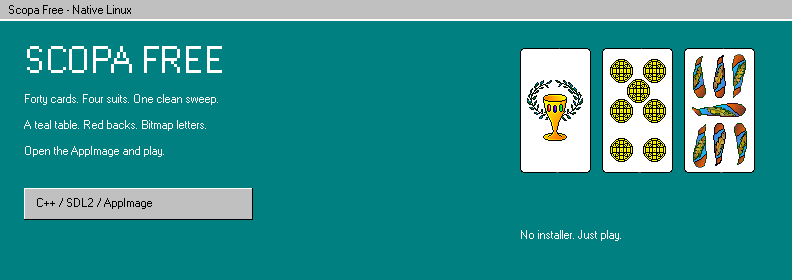
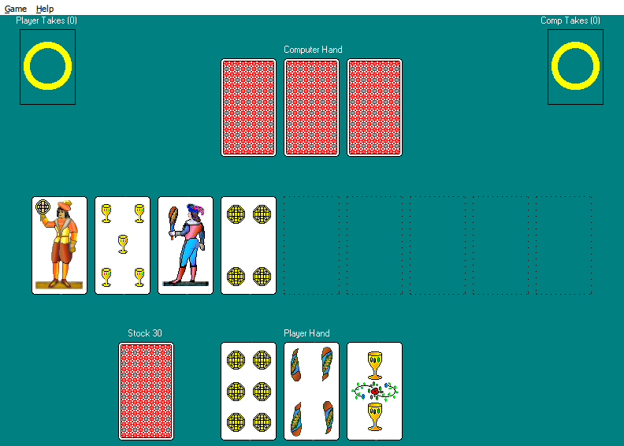
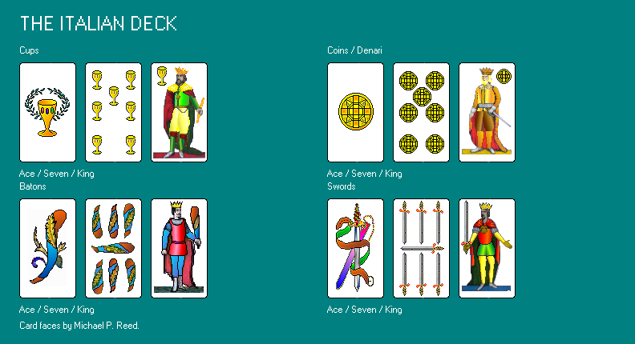
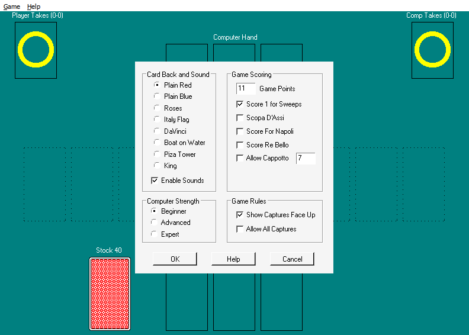

<p align="center">
  <strong>Forty cards. Four suits. One clean sweep.</strong><br>
  Scopa Free on Linux - download the AppImage and play.<br><br>
  <a href="#play">Play</a> ·
  <a href="#the-deck">The deck</a> ·
  <a href="#building">Build</a> ·
  <a href="docs/BUILD.md">Technical notes</a>
</p>

---

A teal table. Red card backs. Little bitmap letters. Nothing getting in the way
of the next hand.

**Scopa Free** is a native C++/SDL2 card game for Linux with Italian suits,
sounds, and a deliberately old-school interface. Cards are **71 × 125 pixels**,
drawn without smoothing. Resize the window and the cards stay that size while
the layout opens up - hands, table and piles move apart across the felt.

No installer. No system packages. Make the AppImage executable and run it.

## Play

Download **`Scopa-Free-x86_64.AppImage`** from the
[latest release](https://github.com/MusicMonsterMod/scopa-free/releases/latest).

```sh
chmod +x Scopa-Free-x86_64.AppImage
./Scopa-Free-x86_64.AppImage
```

**Click the stock pile to deal.** Click a card in your hand, then its target on
the table. That is the interface.



If your system cannot mount AppImages, extract and run in one step:

```sh
./Scopa-Free-x86_64.AppImage --appimage-extract-and-run
```

## The deck



Italian suits throughout: cups, coins, batons and swords. All eight card backs
and both sounds ship with the game. The faces are Michael P. Reed's artwork.

## How to play

1. **Click the stock** to deal three cards to each player and four to the table.
2. **Click your card.** It turns negative.
3. **Click a matching table card** to capture it. For a sum capture, click the
   table cards in that combination. If no capture is possible, click an empty
   table space to place your card.
4. When both hands are empty, **click the stock again** for the next three cards.

A single matching card takes priority over a sum unless **Allow All Captures**
is enabled. The last player to capture takes the cards left on the table.

The **Game** menu holds new games, seeded deals, replay, options, statistics and
scores. **Help** holds the rules.

| Key | Action |
| --- | --- |
| `Space` | Deal from the stock |
| `1` / `2` / `3` | Select a card slot |
| `Enter` | Play / accept a score dialog |
| `Tab` | Choose the next legal capture |
| `H` | Suggest a play |
| `F1` | Help |
| `F2` / `F3` / `F4` | Random game / select seed / replay |
| `F5` / `F6` / `F7` | Options / statistics / score |
| `M` / `B` | Toggle sound / change card back |
| `Esc` | Cancel selection or dismiss a dialog |

Repeatable deal:

```sh
./Scopa-Free-x86_64.AppImage --seed 42
```

## Options



Choose a card back, sounds, computer strength, target score and scoring rules.
Optional variants include Scopa D'Assi, Napoli, Re Bello, Cappotto,
face-up captures and alternative sum captures. Help explains each one.

Defaults: plain red backs, Beginner opponent, sound and face-up captures on,
target 11, **Score 1 for Sweeps** on; other optional scoring switches off.

Matches, preferences and statistics stay in memory for the session. The game
does not write config files or score databases to your home directory.

## Building

```sh
./build.sh
```

This compiles the game, runs the rules tests, bundles libraries and writes
`dist/Scopa-Free-x86_64.AppImage`. Assets and the pinned AppImage runtime are in
the repo, so a normal rebuild is offline. The script does not use `sudo` or
install packages for you.

**Prerequisites:** x86-64 Linux, G++ with C++17, SDL2 development headers,
`pkg-config`, Python 3, `mksquashfs`, and standard shell utilities. Pillow is
needed only to regenerate art, compare screenshots, or replace the icon.

See [build and portability notes](docs/BUILD.md) for details.

## Portability

The x86-64 AppImage bundles SDL2, its libraries and a matching GNU libc loader.
Software rendering avoids depending on a particular GPU driver.

Validated on Linux Mint/X11 with mouse and keyboard play, complete rounds,
window resizing, and 500 automated matches. Wayland and other distros may work
via the bundled SDL2, but were not the primary test target.

## Credits

**Scopa Free** began as David Bernazzani's Windows freeware (1.06, 1999), with
Italian card faces by Michael P. Reed
([My Abandonware](https://www.myabandonware.com/game/scopa-free-l4k)).
This Linux edition is by **Music Monster, 2026** - new native code under the
same title and artwork. Rights notes: [NOTICE.md](NOTICE.md).

**Bitmap typography:** Wine's open-source MS Sans Serif font.  
**Rules reference:** [Scopa on Pagat](https://www.pagat.com/fishing/scopa.html).  
**AppImage runtime:** [AppImage/type2-runtime](https://github.com/AppImage/type2-runtime).
